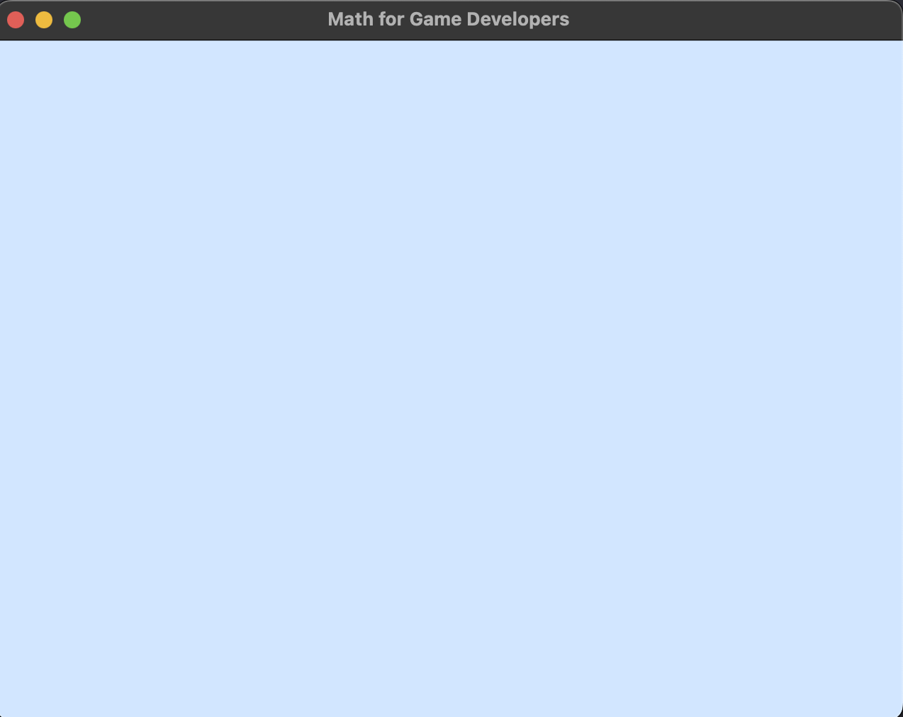
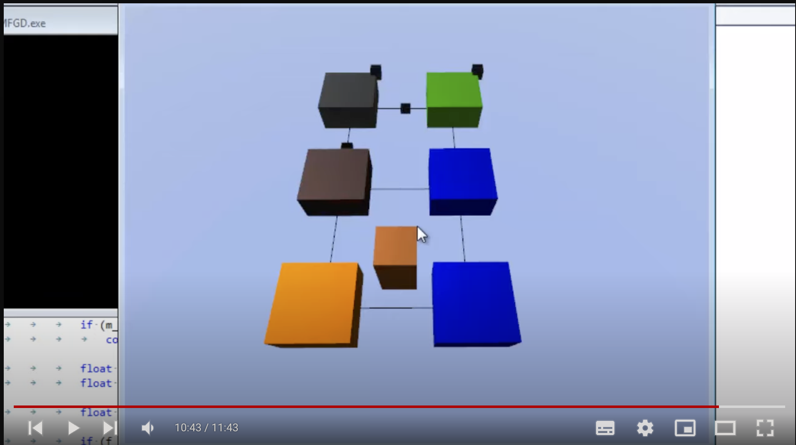

# Desmistificando a Matemática e a Física

## Objetivo Principal deste Material

**Desmistificar** – Desfazer um mito, retirar o caráter de mito.

- Para que serve $cos(θ)$, Professor?
- Qual é o significado de aprender $v = \frac{\Delta d}{\Delta t}$?
- ...

Possivelmente, assim como eu, essas e outras perguntas não foram respondidas na escola primária e, mesmo no ensino superior, ao contrário, muitas vezes criava-se uma aura mística em torno de assuntos tão triviais. Com este curso, muitas das perguntas não apenas serão respondidas, mas também demonstradas na prática, sem a rigidez de uma aula monótona e sem a insegurança de repassar conhecimento. Divirta-se.

Template básico para o curso Matemática para Desenvolvedores. Este primeiro exemplo é completado conforme a imagem abaixo:

# Tecnologias Utilizadas:

- OpenGL 3.3
- GLFW 3.3.4
- CMake >= 3
- C++11
- Glad compatível com a versão do OpenGL
- Visual Studio Code
- ChatGpt (para esclarecer todas as dúvidas específicas)

# Sistema Operacional:

OS Ventura 13.4 (M1)
> [!IMPORTANTE]  
> Por ser um projeto usando CMake, pode ser executado em qualquer sistema (Windows, Linux...).

Este curso é baseado em um curso mais antigo (por volta de 2013) em inglês. Apesar de não estar atualizado, mesmo que a tecnologia tenha avançado, a matemática e a física em si (foco do curso) não mudaram, portanto, é um curso antigo, mas extremamente válido nos dias atuais. Decidi traduzi-lo para o português e atualizar as bibliotecas para as versões mais recentes, com o intuito de disseminar cada vez mais a aplicação da física e da matemática, principalmente em simulações e jogos.

Não vou focar na tecnologia em si (shaders, OpenGL, GLFW), mas irei disponibilizar ramos evolutivos, começando pelo template básico (sem renderizar nada) e progredindo.

# Curso Original (Inglês)

Link para o vídeo:

[ **Link para o Repositório**](https://github.com/BSVino/MathForGameDevelopers/tree/basis-vectors)
